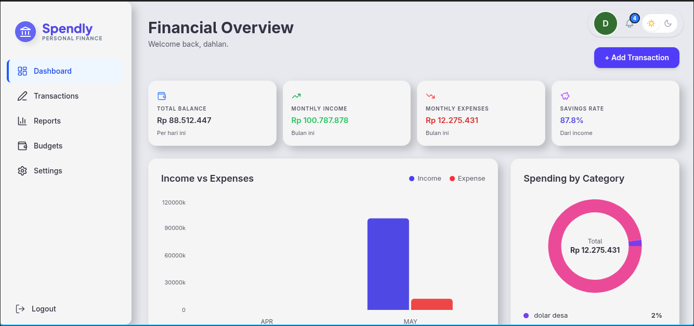
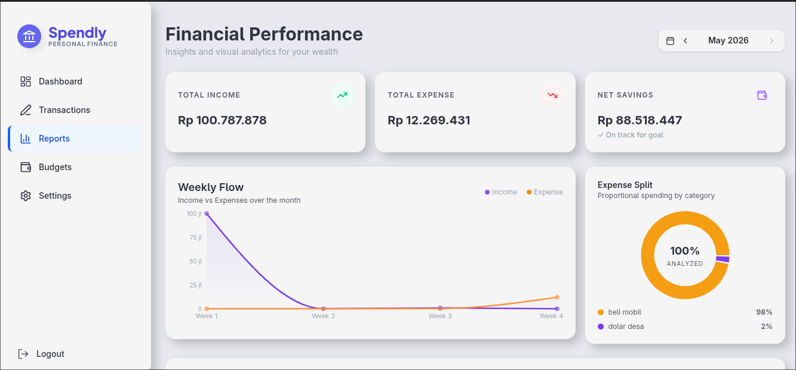

# 💰 SPENDLY v1.0

Modern financial management web application built to help users track income, expenses, budgeting, and financial activity with a clean and interactive user experience.

---

## ✨ Features

- 🔐 Authentication System
- 🌐 Google Authentication
- 🔑 Forgot Password via Email
- 📬 Mailtrap Email Integration
- 📊 Financial Dashboard
- 💸 Income & Expense Tracking
- 🏷 Category Management
- 📅 Transaction History
- 📈 Analytics & Statistics
- 🔔 Notification System
- 💼 Budget Planning
- 🌙 Dark Mode Support
- 📱 Responsive Design
- 🔎 Smart Filtering & Search
- 📄 API Documentation with Scramble

---

## 🖼 Preview

### Auth Preview

### Dashboard

### Analytics

---

# ⚡ Tech Stack

## Frontend

- React
- TypeScript
- Tailwind CSS
- Axios
- TanStack React Query
- Zustand
- React Router DOM
- Lucide React
- Chart.js
- Recharts
- Lenis
- SweetAlert2
- Dotenv

---

## Backend

- Laravel 13
- Laravel Sanctum
- Google OAuth
- Mailtrap
- Scramble API Documentation

- GitHub: https://github.com/Mr-Dahlan/spendly-bakcend
---

## 🔐 Authentication Features

- Email & Password Login
- Google OAuth Login
- Forgot Password System
- Secure Authentication using Sanctum
- Protected Routes & Middleware

---

## 📊 Financial Features

- Add Income & Expense
- Transaction Filtering
- Financial Analytics
- Category-Based Tracking
- Budget Planning
- Notification Reminder
- Dashboard Statistics

---

## 🎨 UI/UX

- Modern Dashboard Design
- Responsive Layout
- Dark Mode
- Smooth Scrolling with Lenis
- Skeleton Loading States
- Interactive Charts
- Clean User Experience

---

## 🚀 Future Improvements

- [ ] Export Transaction Reports
- [ ] Recurring Transactions
- [ ] PWA Support
- [ ] Mobile Application
- [ ] Team / Shared Wallet
- [ ] Saving & Investing Mode

---

## 👨‍💻 Author

Made with ❤️ Team Nine

GitHub: https://github.com/Mr-Dahlan

---

## 📄 License

This project is licensed under the MIT License.